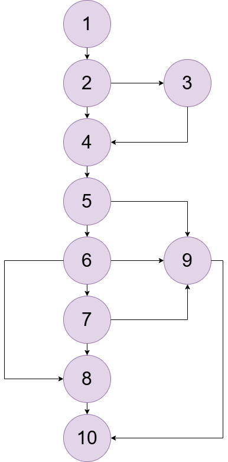

# AF_Teste_Caixa_Branca_UIUX

## Complexidade Ciclomática

**Fórmula:** `M = E - N + 2P`, onde:

* **E (Arestas):** 14
* **N (Nós):** 10
* **P (Componentes):** 1

**Cálculo:**
> M = 14 - 10 + 2(1)
>
> M = 4 + 2
>
> M = 6

**R: A complexidade ciclomática é 6.**

## Grafo de Fluxo

## Caminhos Básicos

* **Caminho 1:** `1 -> 2 -> 3 -> 4 -> 5 -> 9 -> 10`
* **Caminho 2:** `1 -> 2 -> 4 -> 5 -> 9 -> 10`
* **Caminho 3:** `1 -> 2 -> 4 -> 5 -> 6 -> 8 -> 10`
* **Caminho 4:** `1 -> 2 -> 4 -> 5 -> 6 -> 7 -> 8 -> 10`
* **Caminho 5:** `1 -> 2 -> 4 -> 5 -> 6 -> 9 -> 10`
* **Caminho 6:** `1 -> 2 -> 4 -> 5 -> 6 -> 7 -> 9 -> 10`
